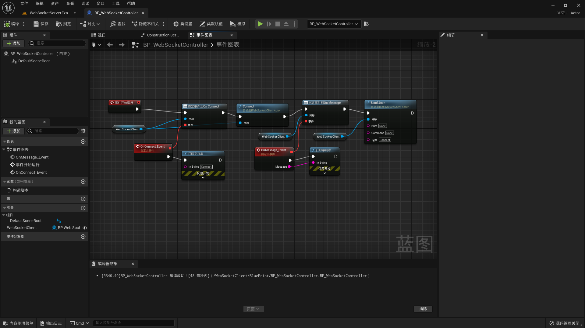

# Get Started

1. First you need to prepare a WebSocket service  

2. Search for WebSocketClient in Unreal Mall, find the plug-in, click to install, it supports Unreal Engine 4.27 and above;

3. Drag the BP_WebSocketClientActor under WebSocketServerClient content/BluePrint into the scene, and fill in the WS address in the Server URL in the details panel (for example: ws://127.0.0.1:9091)

4. BP_WebSocketController under WebSocketServerClient content/BluePrint provides blueprint usages such as connection, sending messages, receiving messages, etc., you can refer to

5. Click to run, you can try to communicate with WebSocket Server

# Simple description

## Provided blueprint events

1. OnMessage(const FString& Message)  *Message callback sent by WebSocket server*

2. OnJsonMessage(const FString &Type, const FString &Command, const FString &Brief) *Same as OnMessage, but the message sent by the server can be parsed into three fields of Type, Command, and Brief according to the Json format (provided that the message sent by the WebSocket server conforms to this Json format)*

3. OnConnect(void) *Callback event when the WebSocket connection is successful*

4. OnClose(int32 StatusCode, const FString& Reason, bool WasClean) *Message callback when the WebSocket server is closed*

5. OnError(FString Message) *Message callback when there is an error connecting to the WebSocket server or an error occurs on the WebSocket server*

## Provided blueprint functions

1. void SendMessage(const FString &Message) *Send a message to the WebSocket server*

2. void SendJson(const FString& Brief, const FString& Command, const FString& Type) *Same as SendMessage, but parse Type, Command, and Brief into Json format and send*

3. void Connect(); *The first function to call! Connect to the WebSocket server*

4. bool IsConnected(); *Whether the connection is successful*

5. void Close(); *Close connection*

# Featured Demos

1. Use Actor to connect to the WebSocket server to facilitate communication in your background under the cloud rendering architecture
2. Support custom IP, port
3. Provide blueprint calls, including receiving message events, connection events, and sending message events
4. Provide simple JSON serialization, provide Brief, Command, Type three fields, easy to build your own instruction set
5. For the packaged program, provide command line mode to set IP and port -ws ws://127.0.0.1:9091
